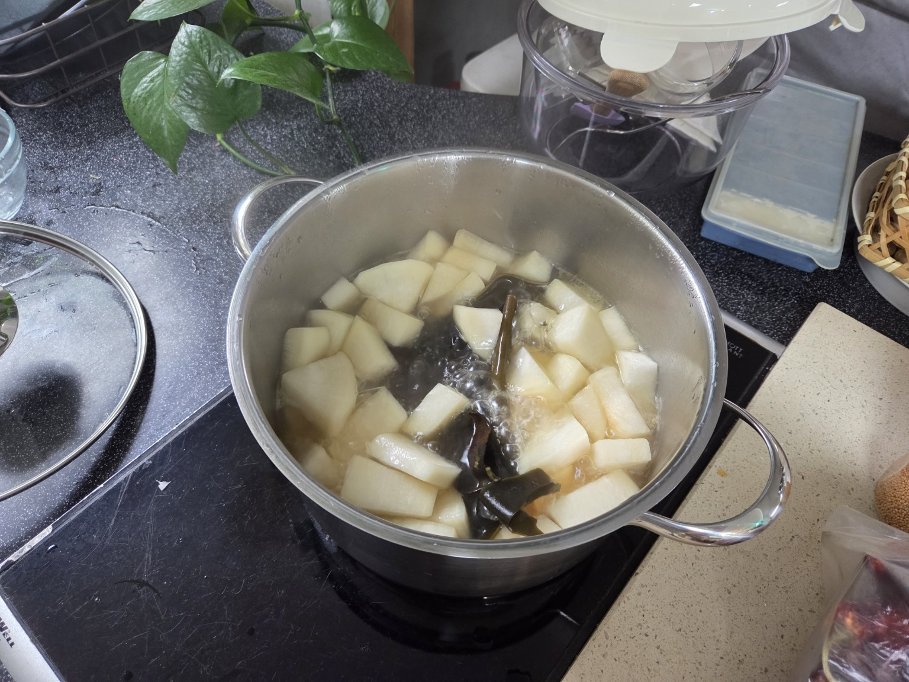

# 비건 무 스프 (Vegan Mu Soup)

## 재료
- 무 1kg
- 다시마 150g
- 소금 약간
- 물 1.5리터
- 엑스트라 버진 올리브 오일 1큰술
- 코코넛오일 1큰술

## 만드는 방법
1. 무를 깍둑썰기로 잘라 준비한다.
2. 냄비에 코코넛오일을 넣고 무를 볶아준다.
3. 무가 노릇하게 익으면 물과 다시마를 넣는다.
4. 무가 반투명해질 때까지 끓인다.
5. 소금으로 간을 맞춘다.
6. 불을 끄고 엑스트라 버진 올리브 오일을 넣어 향을 더한다.
